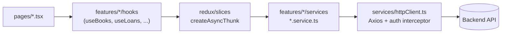

# Library Management System — Frontend

The staff-facing web client for the Library Management System: catalog and inventory
management, member records, the circulation desk (checkout/return), staff administration,
and an operational dashboard with an overdue-loans report.

## Tech stack

- React 19 + TypeScript, built with Vite
- MUI (Material UI) v9 for components and theming
- Redux Toolkit for state (`combineSlices`, `createAsyncThunk`)
- React Router DOM v7
- Axios for HTTP, with a DI'd auth interceptor
- Vitest + React Testing Library + MSW for unit/component tests
- Playwright for end-to-end tests

## Architecture

Each feature (`auth`, `books`, `categories`, `copies`, `members`, `loans`, `staff`, `dashboard`)
owns its own `types → service → Redux slice → hook → form dialog` stack under
`src/features/<name>/`; a route-level page in `src/pages/` composes a feature's hook and dialog
components into the full screen (filters, table, dialogs). Cross-cutting concerns — the shared
Axios instance, the MUI theme, small reusable components, and generic hooks — live outside
`features/` at the top level of `src/`.



## Prerequisites

- Node.js 22+
- The backend API running and reachable (see `../../backend/README.md`), or the full
  stack via Docker Compose (see below)

## Getting started

```bash
npm install
cp .env.example .env   # adjust if your backend isn't on localhost:8000
npm run dev
```

The dev server proxies `/api/*` to the backend (`VITE_API_PROXY_TARGET` in `.env`,
default `http://localhost:8000`) — see `vite.config.ts`. Sign in with a staff account
seeded on the backend.

### Running the full stack with Docker

From the repository root:

```bash
docker compose up -d --build
```

This starts Postgres, the backend API (`:8000`), and this frontend served via nginx
(`:80`), which proxies `/api/` to the backend container — see `nginx.conf`. Rebuild
(`--build`) after backend or frontend source changes; the containers don't hot-reload.

The production image is a two-stage build: `node:22-slim` runs `npm ci && npm run build`, and
the resulting `dist/` is copied into an `nginx:stable-alpine` stage that serves it on port 80.
nginx also handles SPA routing (`try_files ... /index.html`, so deep links like `/books/123`
survive a refresh) and proxies `/api/` to the `backend` container — this keeps the deployed app
same-origin with its API, so it doesn't depend on CORS in production.

## Available scripts

| Command                 | Purpose                                              |
| ----------------------- | ----------------------------------------------------- |
| `npm run dev`           | Start the Vite dev server                            |
| `npm run build`         | Type-check (`tsc -b`) then build for production      |
| `npm run preview`       | Serve the production build locally                   |
| `npm run lint`          | ESLint                                               |
| `npm run format`        | Prettier — write                                     |
| `npm run format:check`  | Prettier — check only                                |
| `npm run typecheck`     | `tsc -b --noEmit`                                    |
| `npm test`              | Unit/component tests (Vitest)                        |
| `npm run test:watch`    | Unit/component tests, watch mode                     |
| `npm run test:coverage` | Unit/component tests with coverage                   |
| `npm run e2e`           | End-to-end tests (Playwright, builds + serves first) |
| `npm run e2e:install`   | Install the Playwright Chromium browser + deps       |

Before opening a PR, all of `lint`, `typecheck`, `format:check`, `test`, `build`, and
`e2e` should pass — this is exactly what `.github/workflows/ci.yml` runs.

## Project structure

```
src/
  app/          App shell composition, providers, the top-level ErrorBoundary
  components/   Small shared components used across features (ConfirmDialog,
                FeedbackSnackbar, Loader)
  features/     One folder per domain area (auth, books, categories, copies, members,
                loans, staff, dashboard), each with its own types/, services/, hooks/,
                and components/
  hooks/        Cross-cutting hooks (useDebouncedValue, useDocumentTitle)
  layouts/      AppLayout, Header, Sidebar
  pages/        Route-level components — compose a feature's hook + components
                into a full page (filters, table, dialogs)
  redux/        Store setup and one slice per feature, mirroring features/
  routes/       AppRoutes, ProtectedRoute
  services/     The shared Axios instance and its auth interceptors
  theme/        MUI theme customization (palette, typography, component overrides)
  types/        Types shared across features (API envelope, domain enums)
  utils/        Small pure helpers (API error message extraction)
  tests/        Vitest setup, MSW handlers/server, the shared `render` test util
e2e/            Playwright specs (one per feature area, mocking the API at the
                network boundary via page.route)
```

Each feature follows the same internal shape: `types → service → Redux slice → hook →
form dialog → page`. See `src/features/books/**` for the canonical example.

## Routing

React Router v7, `BrowserRouter`. All routes except `/login` are nested under a
`ProtectedRoute` wrapper (`src/routes/ProtectedRoute.tsx`), which reads auth state, shows a
`Loader` while the initial session check (`GET /auth/me`) is in flight, and redirects to
`/login` (preserving the attempted location) if unauthenticated. Non-login routes are
`lazy()`-loaded behind a `Suspense` boundary, so the initial bundle only ships the login
screen. The Staff page's nav link is hidden for non-admins, but the route itself is not
further role-gated client-side — enforcement is on the backend.

## State management

Redux Toolkit — `combineSlices` + `configureStore` in `src/redux/store.ts`, one slice per
feature. Each slice uses `createAsyncThunk` for API calls and tracks a `status` field
(`idle | loading | succeeded | failed`) plus separate error/mutation state. `setupStore()` is
a factory (not a bare singleton) so tests can construct isolated stores. The auth token is the
one piece of state persisted outside Redux, in `localStorage`.

Not everything lives in Redux: page-scoped derived data that doesn't need to be shared across
components stays in local hook state instead — e.g. `useLoanEnrichment` (resolves member/copy/
book details for the loans table, since loan records only carry raw IDs) and
`useBookCopyCounts` (per-book available/total counts on the books page).

There is no Context API usage for app state, no React Query/TanStack Query, and no
redux-persist — Redux state (other than the auth token) resets on reload.

## API integration

A single shared Axios instance (`src/services/httpClient.ts`) with two interceptors, wired up
after the store is constructed to avoid a circular import between the store and the HTTP layer:

- **Request**: attaches `Authorization: Bearer <token>` when a token is present.
- **Response**: on `401`, invokes an injected `onUnauthorized` callback (dispatches `logout()`).

Each feature has a `*.service.ts` that wraps `httpClient` calls and returns typed data (either
a `Page<T>` envelope or a single entity). `src/utils/apiError.ts` normalizes both backend error
shapes — a domain error's `{"detail": "message"}` and FastAPI's `422` validation
`{"detail": [...]}` — into one displayable string, also covering network errors and non-Axios
throwables.

## Reusable components

| Component | Props | Purpose |
|---|---|---|
| `ConfirmDialog` | `open, title, description, confirmLabel? (default 'Delete'), isConfirming, onCancel, onConfirm` | Shared destructive-action confirmation dialog, used for delete/archive flows |
| `FeedbackSnackbar` | `open, message: string \| null, severity: 'error' \| 'success', onClose` | Standardized toast for success/error feedback after mutations |
| `Loader` | `label? (default 'Loading')` | Full-viewport centered spinner, used as the route Suspense fallback and session-check indicator |

`src/app/ErrorBoundary.tsx` (a class component, since error boundaries have no hook
equivalent) wraps the whole app and renders a fallback screen with a reload button on an
uncaught render error.

## Custom hooks

- `useDebouncedValue<T>(value, delayMs)` — returns `value` only after it stops changing for
  `delayMs`; used to debounce search/filter inputs.
- `useDocumentTitle(title?)` — sets `document.title` to `"{title} · Neighbour Library"`.
- One Redux-backed hook per feature (`useAuth`, `useBooks`, `useCategories`, `useMembers`,
  `useCopies`, `useLoans`, `useStaff`, `useDashboard`) — the seam between a page and its slice,
  dispatching thunks and exposing derived loading/mutating booleans.
- `useLoanEnrichment`, `useBookCopyCounts` — page-scoped derived-data hooks (see
  [State management](#state-management)).

## Theme

`src/theme/` composes a `createTheme()` call from three files: `palette.ts` (a restrained,
light-only palette — neutral greys with a single desaturated blue accent), `typography.ts`
(system font stack, compact heading scale, no uppercase buttons), and `components.ts`
(component-default overrides: disabled ripples/elevation, flat 1px borders instead of shadows,
dense table/form-control sizing). There is no dark-mode toggle.

## Forms

No form library (no react-hook-form/Formik) — every form dialog uses plain `useState` for field
values with manual `onChange`/`handleSubmit` and inline validation, surfacing errors via an MUI
`Alert`. Dialogs are remounted with a fresh `key` on open/edit rather than re-syncing form state
via an effect.

## Build process

`npm run build` runs `tsc -b` (project-references type-check across `tsconfig.app.json` and
`tsconfig.node.json`, both with the full strict-family flags enabled, including
`noUncheckedIndexedAccess`) and then `vite build`. The `@` path alias resolves to `src/` in both
TypeScript and Vite config. Linting is a flat ESLint config (`typescript-eslint`'s type-checked
presets + `react-hooks` + `react-refresh`, with `eslint-config-prettier` applied last);
formatting is Prettier (`singleQuote`, `trailingComma: all`, `printWidth: 100`).

## Testing

- **Unit/component tests** (`npm test`) run against MSW-mocked API responses and a
  real (per-test) Redux store — see `src/tests/handlers.ts` for the fixtures and
  `src/tests/test-utils.tsx` for the shared `render` wrapper (Provider + Router +
  Theme). Vitest config lives inline in `vite.config.ts` (`environment: 'jsdom'`, coverage via
  `@vitest/coverage-v8`).
- **E2E tests** (`npm run e2e`) run against a production build served by `vite
  preview`, with the backend API mocked via Playwright's `page.route`. They don't
  require the real backend or Docker to be running. Specs cover the login flow, books CRUD,
  members CRUD, issuing/returning loans, and the dashboard.
  Requires `.env` to exist (see [Getting started](#getting-started)) — `VITE_API_BASE_URL` is
  baked into the bundle at build time, so without it API calls resolve to the wrong path and
  every spec fails at login.

## Environment variables

See `.env.example`. `VITE_API_BASE_URL` is read by the app at runtime (client-side);
`VITE_API_PROXY_TARGET` is read by `vite.config.ts` (Node-side, dev server only) to
pick the dev-server proxy target and is not exposed to client code.

## Design decisions

- **Redux Toolkit over React Query**: since most screens are CRUD tables with their own
  filter/sort/pagination state and mutation feedback, a slice per feature (list state + mutation
  state together) fit better than a query-cache library — at the cost of writing more explicit
  loading/error state per slice than a query library would give for free.
- **Feature-folder convention over layer-folder convention**: each domain area is self-contained
  (`types/services/hooks/components`) rather than splitting by technical layer, to keep related
  code together as the app grows.
- **No form library**: the forms are simple enough (a handful of fields, no nested/dynamic
  arrays) that plain `useState` avoided pulling in a dependency.
- **Derived-data hooks stay outside Redux** when the data is scoped to a single page and doesn't
  need to be shared — avoids polluting global state with what's effectively a view-model.
